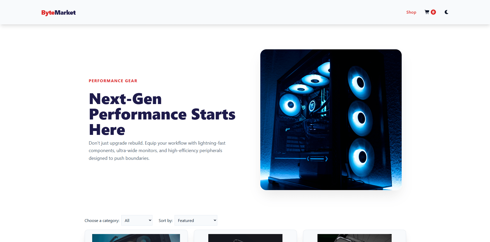
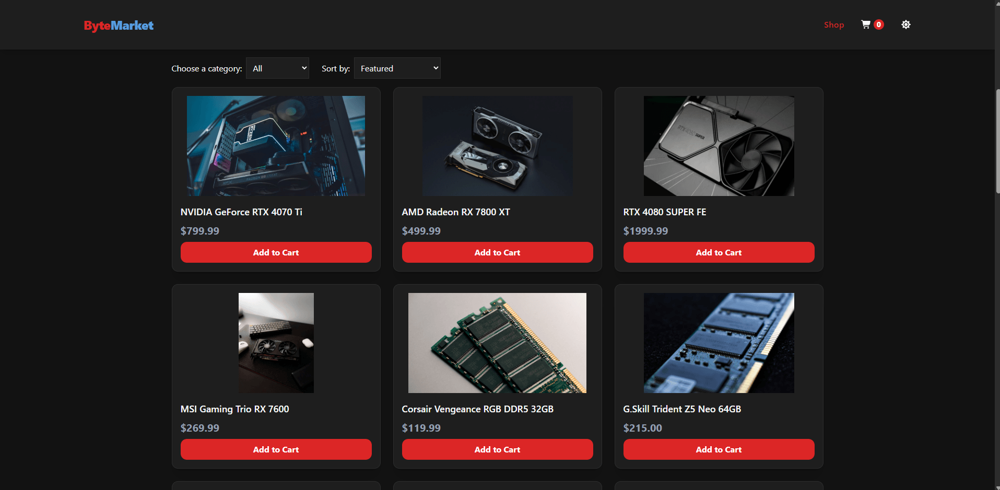
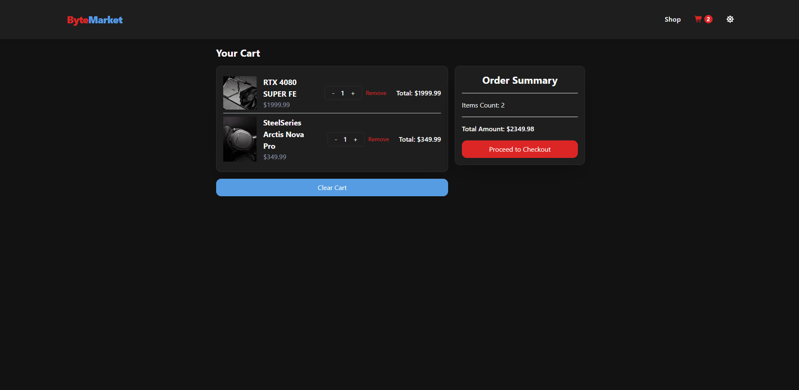

# ByteMarktet

This is a personal project and not an actual e-commerce store. It is built using PERN Stack (PostgreSQL, Express, React + Tailwind and Node.js).

Link: https://byte-market-ten.vercel.app/

## Interface Preview

| Homepage View (Light Mode) | Product Catalogue (Dark Mode) |
| :---: | :---: |
|  |  |

| Cart | Walkthrough | 
| :---: | :---: |
|  | 

## Features

* **Global Theme Engine:** Custom-engineered `useTheme` React hook managing theme switching seamlessly synchronized with Tailwind CSS configuration layers.
* **Dynamic Product Database:** Relational product grid sourcing custom data rows straight from a remote PostgreSQL instance.
* **Component-Driven UI:** Highly modular components featuring category filters, real-time product item sheets, and contextual Toast alerts.
* **Decoupled Deployment:** Client layer deployed continuously on Vercel with server controllers routed on Render.
* **Optimized cloud deployment:** Implementing an external cron-job pinging strategy to bypass platform-induced container hibernation, reducing initial user cold-start. 
* **Skeleton Loading UI:** Integrated skeleton placeholders across the app to create a smooth, modern loading experience while data fetches from the backend.

## Tech Stack & Architecture

### Frontend
* **React** (Functional Hooks & View Routing)
* **Redux Toolkit** (Global Store, Cart Management, Theme Configuration)
* **Tailwind CSS** (Layout and Fluid theme transitions)

### Backend & Database
* **Node.js & Express** (REST API Routings & Controllers)
* **PostgreSQL** (Relational Database Schema & Foreign Key Constraints)